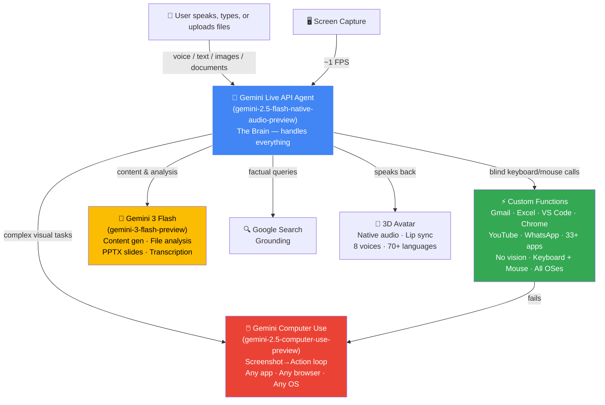
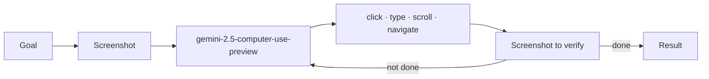

<p align="center">
  
</p>

<h1 align="center">WishCraft — Universal UI Navigator ☸️</h1>
<p align="center"><strong>Voice & Text-Controlled Desktop Genie · 3D Avatar · Cross-Platform Visual Computer Agent</strong></p>
<p align="center">
  <em>A multimodal AI agent that sees your screen (when enabled), understands any UI, and performs actions across any application on any OS — using keyboard, mouse, and Gemini vision. Accepts voice, text, images, videos, audio, and documents. No APIs. No DOM access. Pure visual understanding.</em>
</p>

<p align="center">
  
  
  
  
  
  
  
  
  
  
  
  
</p>

---

## Table of Contents

- [Overview](#overview)
- [Google Cloud Deployment](#google-cloud-deployment)
- [How It Works — The Brain](#how-it-works--the-brain)
- [Computer Use Agent — UI Navigator](#computer-use-agent--ui-navigator-️)
- [Custom Automation Functions](#custom-automation-functions)
- [Features](#features)
- [Platform Support](#platform-support)
- [Download](#download)
- [Getting Started](#getting-started)
- [Usage](#usage)
- [Project Structure](#project-structure)
- [Tech Stack](#tech-stack)
- [Security](#security)
- [Contributing](#contributing)
- [License](#license)
- [Contact & Support](#contact--support)

---

## Google Cloud Deployment

**Live Backend:** [`https://wishcraft-server-47389095635.us-central1.run.app`](https://wishcraft-server-47389095635.us-central1.run.app/api/health)

WishCraft's backend runs on **Google Cloud Run** with the following Google Cloud services:

| Google Cloud Service | What It Does | Proof |
|---|---|---|
| **Cloud Run** | Hosts the backend API server (Node.js + Python) | [server.js](wishcraft-server/server.js), [Dockerfile](wishcraft-server/Dockerfile) |
| **Firestore** | Stores wish history, credit balances, user sessions | [server.js → Firestore init](wishcraft-server/server.js) |
| **Cloud Storage** | Encrypted config backup/restore across devices | [server.js → cloud-sync endpoints](wishcraft-server/server.js) |
| **Firebase Hosting** | Landing page at [wishcraft.web.app](https://wishcraft.web.app) | [firebase.json](wishcraft-website/firebase.json) |
| **Gemini Live API** | Real-time voice conversation (The Brain) | [liveChat.js](wishcraft/renderer/modules/liveChat.js) |
| **Gemini Computer Use** | Visual desktop automation agent (The Hands) | [computer_use_agent.py](wishcraft/python/computer_use_agent.py) |
| **Gemini 3 Flash** | Content generation, file analysis, PPTX design | [geminiCollaborator.js](wishcraft/renderer/modules/geminiCollaborator.js) |
| **Google Search Grounding** | Real-time factual answers | [avatar-app.js → google_search tool](wishcraft/renderer/avatar-app.js) |

**Verify it's live right now:**
```bash
curl https://wishcraft-server-47389095635.us-central1.run.app/api/health
# → {"status":"healthy","geminiApiKey":"configured","firestore":"connected","cloudStorage":"connected"}
```

---

## Overview

WishCraft is a **cross-platform universal UI navigator** powered by **Google Gemini**. Think of it as a 3D animated genie that lives in your system tray — talk to it by voice or type in the chat panel, it can see your screen (when enabled), and does things for you. Open emails, reply to messages, check your Fiverr dashboard, write a CV, create spreadsheets — by voice or text.

What makes it different? **It doesn't use any APIs or DOM access to control your apps.** Instead, it works exactly like a human would — pressing keyboard shortcuts, clicking buttons, and reading the screen visually using Gemini's multimodal capabilities. That means it works with **any application** on **any operating system** — not just the browser.

The system runs entirely on your machine as an Electron desktop app, with a Python bridge handling automation via PyAutoGUI (keyboard/mouse), AppleScript (macOS), PowerShell (Windows), and xdotool (Linux). Each OS has its own platform-specific automation file. Complex tasks that can't be handled by keyboard shortcuts are automatically handed over to a **Gemini Computer Use agent** that takes screenshots, thinks about what to do, and executes actions visually.

---

## How It Works — The Brain

At the heart of WishCraft is a single **Gemini Live API agent** (`gemini-2.5-flash-native-audio-preview`) that acts as the central brain. It handles everything — listening to your voice, watching your screen (when enabled), deciding what to do, and orchestrating all the other models and tools.

The brain has **37 tool declarations** and **two execution paths** it chooses between:
- **Custom functions** — blind, fast keyboard/mouse automation (no vision, no screenshots). The brain triggers them when it knows which app is open and what action to perform.
- **Computer Use agent** — visual AI that automatically takes screenshots (no manual enabling required), analyzes the UI, and clicks. Used for complex tasks, browser navigation, and when custom functions fail (auto-escalation).



Here's how the brain makes decisions:

- **"Open Gmail and reply to that email"** → Calls **custom functions** — blind keyboard shortcuts (`r` to reply, clipboard paste, `Cmd+Enter` to send). No screenshots needed, instant.
- **"Go to Fiverr, check my sales dashboard"** → Hands over to **Gemini Computer Use** — visual AI agent that takes screenshots, analyzes the UI, and clicks through the site.
- **"Write me a professional CV"** → Collaborates with **Gemini 3 Flash** (generates content, writes it to Word using custom functions)
- **"What's the weather in Dhaka?"** → Uses **Google Search grounding** (real-time facts, no hallucination)
- **Custom function fails?** → Auto-escalates to the **Computer Use agent** — the system never gives up

### Three Gemini Models, One Brain

| Model | Role | When the Brain Calls It |
|-------|------|------------------------|
| `gemini-2.5-flash-native-audio-preview` | **The Brain** — real-time voice, optional screen vision, 37 tool declarations, orchestrates everything | Always active (Live API WebSocket) |
| `gemini-2.5-computer-use-preview` | **The Hands** — visual desktop automation via screenshot→action loop | When the task requires visual navigation, complex browser tasks, or when custom functions fail (auto-escalation) |
| `gemini-3-flash-preview` | **The Writer** — content generation, file analysis, PPTX slides, audio transcription | When the user asks to create content, analyze a file, or build a presentation |

### 3-Tier Execution

| Tier | What It Does | Speed |
|------|-------------|-------|
| **1 — Universal** | ~90 fully cross-platform actions — open/close apps, click, type, scroll, drag, screenshot, volume, brightness, file search, background removal, file organizer, Gmail, WhatsApp, notifications — the exact same code runs on every OS via `executor.py` + `commands.py` | <0.5s |
| **2 — Platform Functions** | ~286 platform-specific deterministic functions per OS — **blind automation with no vision**, just keyboard shortcuts + PyAutoGUI + native OS tools. Each OS has its own equivalent module: macOS uses AppleScript (7403 lines), Windows uses PowerShell (734 lines), Linux uses xdotool (820 lines). Covers 33+ apps: Word, Excel, Numbers, VS Code, Finder, Notes, Mail, Calendar, Chrome, YouTube, Safari, Music, etc. The Live API brain triggers these intelligently | 1-3s |
| **3 — AI Visual** | Gemini Computer Use agent — **automatically sees the screen** via screenshots (no manual enabling required), analyzes UI visually, clicks/types at coordinates, verifies with another screenshot, repeats. Used for complex navigation, browser tasks (shopping, forms, reading pages), and unfamiliar UIs | 5-30s |

All three tiers work on **macOS, Windows, and Linux**. Tier 1 is fully universal — the exact same code runs on every OS. Tier 2 has dedicated automation modules per platform with equivalent functions using native OS tools (AppleScript / PowerShell / xdotool). Tier 2 functions are **blind** — no screenshots, no vision — just deterministic keyboard/mouse sequences. If Tier 2 fails → **automatically escalates to Tier 3 (Computer Use agent)**.

---

## Computer Use Agent — UI Navigator ☸️

> **Challenge Focus: Visual UI Understanding & Interaction** — Build an agent that becomes the user's hands on screen. The agent observes the browser or device display, interprets visual elements without relying on APIs or DOM access, and performs actions based on user intent.

This is WishCraft's core capability. The Computer Use Agent takes a screenshot, sends it to `gemini-2.5-computer-use-preview`, gets back an action (click here, type this, scroll down), executes it with PyAutoGUI, takes another screenshot to verify, and repeats until the task is complete. It's like having an AI that can use your computer the way you do.



**How it meets the challenge requirements:**

| Requirement | How WishCraft Does It |
|---|---|
| Gemini multimodal interprets screenshots | ✅ `gemini-2.5-computer-use-preview` analyzes screenshots at each turn |
| Outputs executable actions | ✅ 13 actions (click, type, scroll, navigate, drag, etc.) via PyAutoGUI |
| No DOM/API access | ✅ Everything is keyboard + mouse + visual understanding |
| Universal web navigator | ✅ Works on any website — Gmail, Fiverr, YouTube, you name it |
| Cross-application workflows | ✅ Browser + native apps (Excel, VS Code, WhatsApp) on all OSes |
| Hosted on Google Cloud | ✅ Backend on Google Cloud Run with ephemeral token server |

---

## Custom Automation Functions

WishCraft includes **~286 platform-specific + ~90 universal** custom automation functions across its Python backend. These functions are **blind** — they have no vision, no screenshots — they're pure keyboard shortcuts, mouse clicks, and CLI commands that the Live API brain triggers intelligently:

- **`executor.py`** — Universal PyAutoGUI actions (click, type, scroll, drag, screenshot, navigate, etc.) — same code on every OS
- **`commands.py`** — ~90 universal commands (open/close apps, volume, brightness, lock screen, Gmail via keyboard shortcuts, WhatsApp, file search, background removal, file organizer, notifications) — pure Python, works everywhere
- **`macos_automation.py` / `windows_automation.py` / `linux_automation.py`** — ~286 platform-specific functions per OS (Word, Excel, Numbers, Gmail, Chrome, VS Code, YouTube, Finder, Notes, Mail, Calendar, Safari, Music, WhatsApp, and 33+ apps). Each OS has its own equivalent module using keyboard shortcuts + PyAutoGUI with native tools: AppleScript on macOS, PowerShell on Windows, xdotool on Linux

All using **keyboard shortcuts, mouse actions, and native OS tools** — no DOM access, no browser extensions, no screenshots needed. Example: Gmail `r` to reply, clipboard paste for text, `Cmd+Enter` to send.

If any function fails (say Gmail isn't open), the system **auto-escalates to the Computer Use agent** (visual AI) — so you never get stuck.

---

## Features

| Feature | What It Does |
|---------|-------------|
| 🎙️ **Voice + Chat + File Upload** | Talk naturally via Gemini Live API (bidirectional audio, interrupt anytime), type in the chat panel, or upload files (images, videos, audio, PDFs, documents) for AI analysis — fully multimodal |
| 💬 **Chat Panel** | 4-tab frosted glass UI — Chat (conversation + file upload), Tasks, Contacts, Settings. Full chat history saved and encrypted locally |
| 🧞 **Male / Female Avatar** | Switch between male and female 3D genie models. Choose from 8 voices (4 male: Charon, Fenrir, Orus, Puck / 4 female: Aoede, Kore, Leda, Zephyr) — avatar auto-switches to match voice gender |
| 🔑 **Your API Key, Your Credits** | Use your own Gemini API key (stored locally, AES-256-GCM encrypted) — or connect to cloud backend for managed credits. You control your costs |
| 💾 **Fully Local + Optional Cloud** | All data stored locally in `~/.wishcraft/` with AES-256-GCM encryption (API key, memory, contacts, chats). Optional cloud sync via Google Cloud Storage — you choose |
| 👁️ **Screen Vision** | Sees your desktop at ~1 FPS to understand what you're doing |
| 📷 **Webcam Support** | Optional camera feed for face-to-face interaction |
| 🔍 **Google Search Grounding** | Real-time factual answers — weather, news, stocks, no guessing |
| 🔐 **Persistent Memory** | Remembers your name, preferences, and facts across sessions |
| 🌍 **70+ Languages** | 8 primary + 62 additional languages |
| 📊 **PPTX Builder** | Generates PowerPoint presentations with 10 themes and professional layouts |
| 📝 **Content Generation** | CVs, essays, reports, code — writes directly to Word or returns text |
| 🎵 **Audio Transcription** | Transcribes MP3, WAV, M4A, MP4, and more via Gemini |
| 🖼️ **Background Removal** | AI-powered via rembg — single files or batch processing |
| 💬 **WhatsApp Integration** | Send and read messages through Computer Use + deep links |
| 🔄 **Auto-Reconnection** | WebSocket reconnects with conversation context intact |
| 🛡️ **Dedup Protection** | Prevents duplicate Gmail sends when the model repeats tool calls |
| 🧠 **9 Built-in Skills** | Gmail, Excel, Numbers, Mail, PPTX, file organizer, image tools, and more |

---

## Platform Support

WishCraft runs on **macOS, Windows, and Linux**. The key mapping adapts automatically — `command` on macOS becomes `ctrl` on Windows/Linux, and clipboard handling switches between `pbcopy`, PowerShell, and `xclip` depending on your OS.

| Feature | macOS | Windows | Linux |
|---------|:-----:|:-------:|:-----:|
| Electron App + 3D Avatar | ✅ | ✅ | ✅ |
| Real-Time Voice + Chat | ✅ | ✅ | ✅ |
| Screen Vision | ✅ | ✅ | ✅ |
| Computer Use Agent (any app) | ✅ | ✅ | ✅ |
| Custom Automation Functions | ✅ ~286 (AppleScript) | ✅ ~49 (PowerShell) | ✅ ~55 (xdotool) |
| PyAutoGUI (keyboard/mouse) | ✅ | ✅ | ✅ |

Each platform has its own automation module — `macos_automation.py` (keyboard shortcuts + AppleScript), `windows_automation.py` (keyboard shortcuts + PowerShell), and `linux_automation.py` (keyboard shortcuts + xdotool). The key mapping adapts automatically per OS.

---

## Download

Pre-built installers will be available on the [Releases](https://github.com/abubokkor-cse/wishcraft/releases) page.

| Platform | File | Status |
|---|---|---|
| **macOS (Apple Silicon)** | `WishCraft-1.0.0-arm64.dmg` | ✅ Available |
| **macOS (Intel)** | `WishCraft-1.0.0-x64.dmg` | ✅ Available |
| **Windows** | `WishCraft-1.0.0-Setup.exe` | 🔜 Coming soon |
| **Linux** | `WishCraft-1.0.0.AppImage` | 🔜 Coming soon |

You can also build from source — see [Getting Started](#getting-started).

> **Note:** macOS users — on first launch, right-click → Open → "Open Anyway" (app is not notarized). You'll also need to grant Accessibility and Screen Recording permissions in System Settings → Privacy & Security.

---

## Getting Started

### Prerequisites

- **macOS** 12+ / **Windows** 10+ / **Linux** (Ubuntu 20.04+)
- **Node.js** 18+ and **npm**
- **Python 3.9+** with pip
- **Gemini API Key** — [Get one free from Google AI Studio](https://aistudio.google.com/apikey)
- **Google Cloud SDK** (for deploying the backend) — [Install gcloud CLI](https://cloud.google.com/sdk/docs/install)

### 1. Desktop App (Electron)

```bash
git clone https://github.com/abubokkor-cse/wishcraft.git
cd wishcraft

# Install Node.js dependencies
npm install

# Install Python dependencies
pip3 install -r python/requirements.txt

# Start the app
npm start
```

The genie should appear in your system tray.

### 2. Cloud Backend (Google Cloud Run)

The backend handles ephemeral API key tokens, the Computer Use agent proxy, wish history (Firestore), and encrypted config sync (Cloud Storage).

```bash
cd wishcraft-server

# Install dependencies locally (for testing)
npm install

# Create .env file
echo "GEMINI_API_KEY=your-key-here" > .env
echo "GCS_BUCKET=wishcraft-sync" >> .env

# Run locally
npm start
# → Server on http://localhost:3001

# Deploy to Google Cloud Run
gcloud run deploy wishcraft-server \
  --source . \
  --project YOUR_PROJECT_ID \
  --region us-central1 \
  --platform managed \
  --allow-unauthenticated \
  --set-env-vars "GEMINI_API_KEY=your-key,GCS_BUCKET=wishcraft-sync" \
  --memory 1Gi --cpu 1 --timeout 60 --max-instances 5
```

The deploy command builds the Docker container, pushes to Artifact Registry, and deploys to Cloud Run. It prints the live URL when done — paste that into WishCraft Settings > Server URL.

**Live Server:** `https://wishcraft-server-47389095635.us-central1.run.app`

**API Endpoints:**

| Endpoint | Method | What It Does |
|----------|--------|-------------|
| `/api/health` | GET | Health check (shows Firestore/Storage status) |
| `/api/token` | POST | Issues a 5-minute ephemeral token (API key stays server-side) |
| `/api/gemini-key` | GET | Returns API key (requires valid ephemeral token) |
| `/api/computer-use` | POST | Runs Gemini Computer Use agent loop (Python subprocess) |
| `/api/wishes` | GET/POST | Wish history via Firestore |
| `/api/cloud-sync/upload` | POST | Upload encrypted backup to Cloud Storage |
| `/api/cloud-sync/download` | POST | Download encrypted backup from Cloud Storage |
| `/api/credits/balance` | GET | User credit balance |
| `/api/credits/packages` | GET | Available credit packages and pricing |
| `/api/credits/purchase` | POST | Purchase credits (Stripe test mode) |
| `/api/credits/use` | POST | Deduct credits (managed API key mode) |

### 3. Landing Page (Firebase Hosting)

```bash
cd wishcraft-website

# Install Firebase CLI (if not installed)
npm install -g firebase-tools

# Login and deploy
firebase login
firebase deploy --only hosting
# → Live at https://wishcraft.web.app
```

---

## Usage

### Quick Start

1. Press **`Cmd+Shift+G`** (or `Ctrl+Shift+G` on Windows/Linux) to summon the genie
2. Open **Settings** and enter your **Gemini API key**
3. Choose your preferred **language** and **voice**
4. Start talking — or type in the chat panel (**`Cmd+Shift+P`**)

### What Can You Do?

Here are some things you can ask the genie:

- *"Open Gmail, check my latest email, and reply with 'thank you'"*
- *"Create an Excel spreadsheet with my monthly budget"*
- *"Go to Fiverr and check my sales dashboard"*
- *"Write me a professional CV and save it to Word"*
- *"Take a screenshot and analyze what's on screen"*
- *"Play lo-fi music on YouTube"*
- *"Send a WhatsApp message to John saying I'll be late"*
- *"What's the weather in New York?"*

The genie figures out which tool to use — keyboard shortcuts for fast tasks, the Computer Use agent for complex visual navigation, and Gemini 3 Flash for content creation.

### Keyboard Shortcuts

| Shortcut | Action |
|----------|--------|
| `Cmd+Shift+G` | Summon / Dismiss the Genie |
| `Cmd+Shift+P` | Toggle the Chat Panel |

---

## Project Structure

```
├── wishcraft/                      # Electron desktop app
│   ├── main.js                     # Electron main process, Python bridge, PPTX generator
│   ├── preload.js                  # window.wishcraft API (40+ IPC methods)
│   ├── config-store.js             # AES-256-GCM encrypted storage (API key, memory, chats)
│   ├── contacts.js                 # Encrypted contacts with fuzzy matching
│   ├── skills/                     # 9 discoverable skill modules
│   │   ├── skill-registry.js       # Auto-discovers skills, injects into system prompt
│   │   ├── gmail-automation/
│   │   ├── excel-automation/
│   │   ├── presentation-creator/   # 10 themes + pptxgenjs reference
│   │   └── ...
│   ├── python/
│   │   ├── executor.py             # NDJSON stdin/stdout command dispatch
│   │   ├── commands.py             # Universal cross-platform commands (33 actions)
│   │   ├── macos_automation.py     # 300+ macOS functions (AppleScript + PyAutoGUI)
│   │   ├── windows_automation.py   # Windows functions (PowerShell + PyAutoGUI)
│   │   ├── linux_automation.py     # Linux functions (xdotool + PyAutoGUI)
│   │   └── computer_use_agent.py   # Gemini Computer Use visual agent
│   └── renderer/
│       ├── avatar-app.js           # Agent brain — 37 tools, 3-tier routing, Live API
│       ├── avatar.html             # Avatar window (transparent, always-on-top)
│       ├── panel.html / panel.css  # Chat panel UI (4 tabs)
│       ├── smoke.js                # Magical smoke particle effects
│       └── modules/
│           ├── liveChat.js         # Gemini Live API WebSocket client
│           ├── edumindHead.js      # 3D avatar with lip sync + dynamic bones
│           ├── geminiCollaborator.js # Content gen, file analysis, PPTX design
│           ├── dynamicbones.mjs    # Dynamic bone physics for avatar
│           ├── lipsync-en.mjs      # English lip sync phoneme data
│           └── playback-worklet.js # Audio playback AudioWorklet
│
├── wishcraft-server/               # Google Cloud Run backend
│   ├── server.js                   # Express API (12 endpoints)
│   ├── computer_use.py             # Gemini Computer Use agent (Python)
│   ├── Dockerfile                  # Node 20 slim container
│   ├── deploy.sh                   # One-command Cloud Run deploy script
│   ├── requirements.txt            # google-genai SDK (for local development)
│   └── package.json                # express, cors, @google-cloud/firestore, @google-cloud/storage
│
└── wishcraft-website/              # Firebase Hosting landing page
    ├── firebase.json               # Hosting config with security headers
    ├── .firebaserc                 # Project binding
    └── public/
        └── index.html              # Landing page (features, architecture, download)
```

---

## Tech Stack

| Technology | What We Use It For |
|------------|-------------------|
| **Gemini Models** | |
| `gemini-2.5-flash-native-audio-preview` | The brain — real-time voice via Live API, function calling, Google Search grounding |
| `gemini-2.5-computer-use-preview` | The hands — visual automation via screenshot→action loop on any OS |
| `gemini-3-flash-preview` | The writer — content generation, file analysis, PPTX design, transcription |
| **Google Cloud** | |
| Cloud Run | Backend server — ephemeral tokens, Computer Use proxy |
| Firestore | Wish history and session persistence |
| Cloud Storage | Encrypted config backup and sync |
| Firebase Hosting | Landing page at [wishcraft.web.app](https://wishcraft.web.app) |
| **Frontend** | |
| Electron 33 | Cross-platform desktop app |
| Three.js | 3D avatar rendering, lip sync, particle effects |
| PptxGenJS | PowerPoint file generation |
| **Backend** | |
| PyAutoGUI | Cross-platform keyboard and mouse automation |
| Pillow | Screenshot processing |
| rembg | AI background removal |
| **Security** | |
| Node.js `crypto` | AES-256-GCM encryption with machine-specific key derivation |

---

## Security

We take security seriously. All sensitive data is encrypted at rest:

- **AES-256-GCM encryption** for everything — API key, user memory, contacts, chat history
- **Machine-specific keys** derived from SHA-256 of `hostname + username + homedir` — your encrypted files are useless on another machine
- **Electron isolation** — `contextIsolation: true`, `nodeIntegration: false`, `webSecurity: true`
- **API key protection** — never sent in action payloads, passed to Python only via environment variable
- **File access control** — restricted to home directory and `/tmp`
- **Single instance lock** — prevents multiple instances from running

---

## Contributing

We welcome contributions! Here's how you can help:

1. **Fork** the repository
2. **Create** a feature branch (`git checkout -b feature/amazing-feature`)
3. **Commit** your changes (`git commit -m 'Add amazing feature'`)
4. **Push** to the branch (`git push origin feature/amazing-feature`)
5. **Open** a Pull Request

### Ideas for Contributions

- Add more platform-specific automation functions to `windows_automation.py` or `linux_automation.py`
- Add new skill modules (Slack automation, Telegram, etc.)
- Improve the 3D avatar with new animations or models
- Add more languages or voice options
- Write tests for the automation functions

---

## License

This project is licensed under the **MIT License** — see the [LICENSE](LICENSE) file for details.

---

## Contact & Support

- 🐛 **Found a bug?** [Open an issue](https://github.com/abubokkor-cse/wishcraft/issues)
- 💡 **Have an idea?** [Start a discussion](https://github.com/abubokkor-cse/wishcraft/discussions)
- 📧 **Email:** [abubokkor.cse@gmail.com](mailto:abubokkor.cse@gmail.com)

---

<p align="center">
  <strong>"Your wishes are my command." 🧞</strong>
</p>
